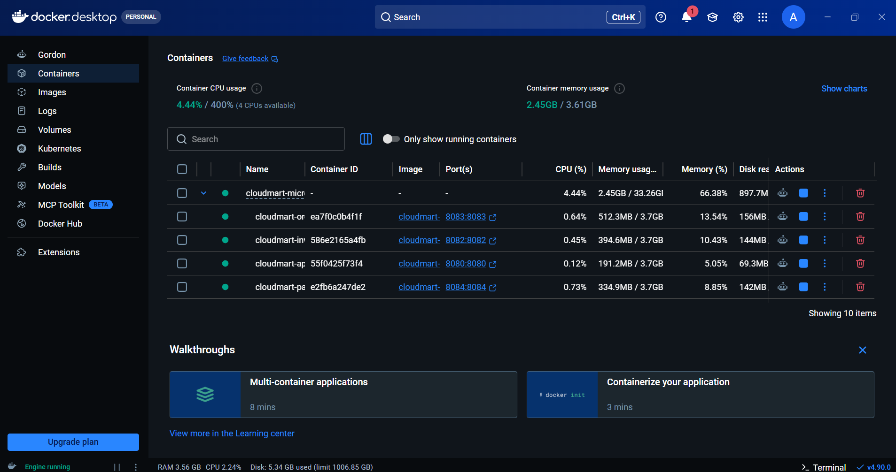
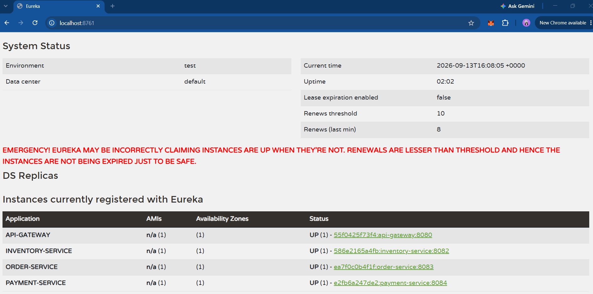
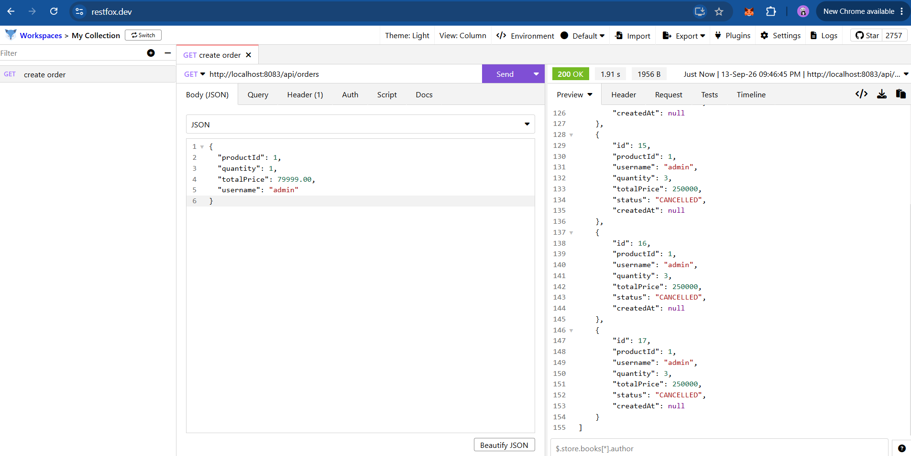
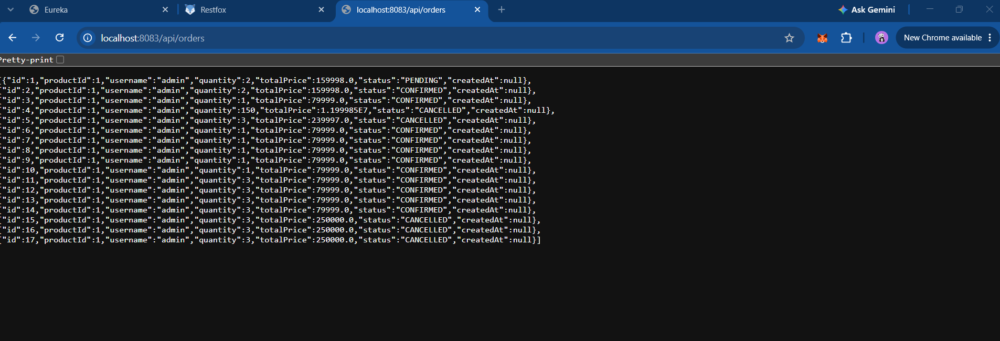

#   CloudMart Microservices Platform

##   Overview
CloudMart is a distributed, event-driven e-commerce backend built with Spring Boot and Apache Kafka. The architecture uses the Saga Choreography Pattern to manage distributed data consistency across microservices with automatic compensating rollbacks.

---

##    Features

- Event-Driven Architecture: Asynchronous Kafka messaging between microservices.

- Saga Choreography: Automated compensation rollbacks on order or payment failures.

- Service Discovery: Dynamic routing and health registration via Netflix Eureka.
  
- Central API Gateway: Single entry point using Spring Cloud Gateway.
  
- Isolated Persistence: Independent databases for Order, Inventory, and Payment services.
  
- Multi-Container Setup: Orchestrated using Docker Compose.

---

##     Tech Stack

- Backend: Java 17, Spring Boot, Spring Cloud (Eureka, Gateway)
  
- Messaging: Apache Kafka, Zookeeper
  
- Databases: PostgreSQL, MongoDB
  
- DevOps: Docker, Docker Compose
  
- API Testing: Restfox

---

##    How It Works

1. Client sends a request to create an order via API Gateway.
2. Order Service creates the record with status PENDING and publishes an event to Kafka.
3. Inventory Service verifies and reserves available stock.
4. Payment Service processes transaction validation.
5. Saga Outcome:
   - Happy Path: Order transitions to CONFIRMED.
   - Rollback Path: If payment fails, compensation events release inventory and mark the order as CANCELLED.

---

##    Project Structure

cloudmart-microservices/
+-- api-gateway/            # Port 8080
+-- discovery-server/       # Port 8761
+-- order-service/          # Port 8083
+-- inventory-service/      # Port 8082
+-- payment-service/        # Port 8084
+-- common-events/          # Shared Kafka models
+-- docker-compose.yml      # Container orchestration
+-- screenshots/            # Architecture & verification proof
\\\

---

##     Verification

### 1. Docker Containers

### 2. Eureka Service Registry

### 3. API Execution (Restfox)

### 4. Saga Lifecycle (Confirmed vs Cancelled)

---

##    Future Scope
- Distributed tracing using Micrometer and Zipkin
- Circuit Breaker and Rate Limiting with Resilience4j
- Kubernetes deployment manifests
